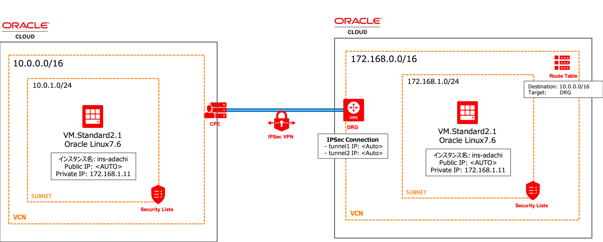
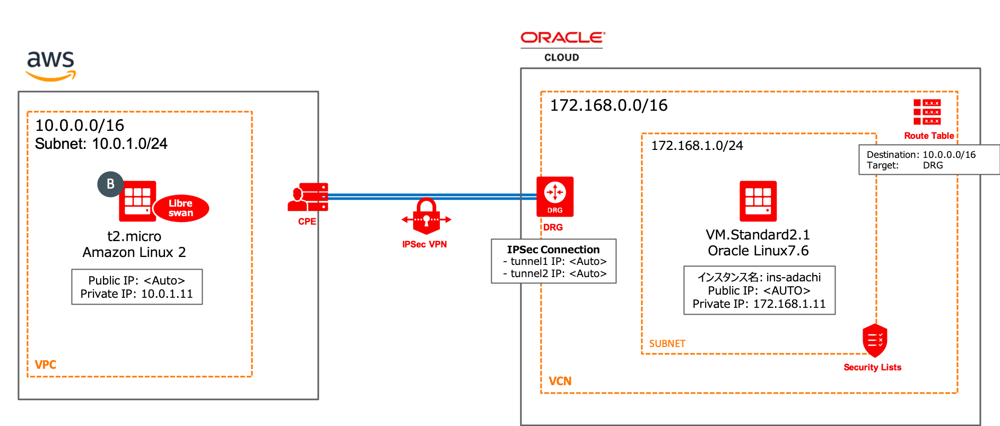

# Oracle Cloud Infrastructure IPsec Examples
This repository contains following two examples.

1. OCI(libreswan) <----> (OCI IPSec Connections) <-----> OCI

2. AWS(libreswan) <----> (OCI IPSec Connections) <-----> OCI

If you'd like to try them, you should go to bellow directories

1. [OCI and OCI](./oci_oci)
2. [AWS and OCI](./oci_aws)

