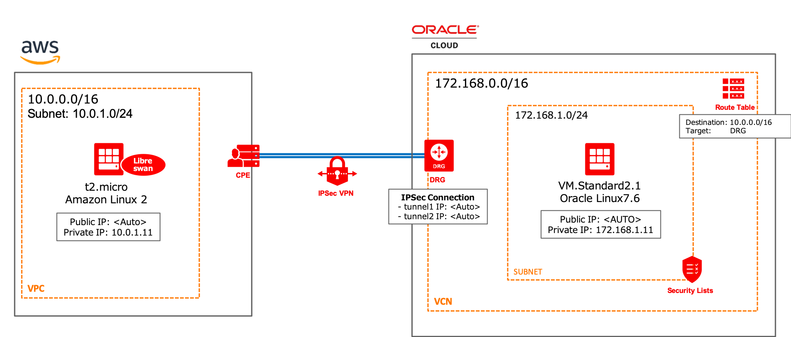

# Oracle Cloud Infrastructure IPsec Examples
## AWS(libreswan) <----> (OCI IPSec Connections) <-----> OCI



## How to run

1. Set env-vars
In this file, you should write necessary information (like below) in order to build cloud environments by terraform.

- User Credentials (user_ocid, fingerprint ..etc)
- Region
- ssh_key files
- and so on...

[env-vars-sample](./env-vars-sample) is a good exaple.

2. Load env-vars

```
$ source env-vars
```

3. Run Terraform

```
# Init
$ terrafrom init

# Plan
$ terraform plan

# Apply
$ terraform apply
```

4. Clean environments

```
$ terraform destroy
```

